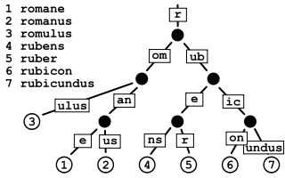

# Gin-路由

#### Radix Tree

基数树 （英语：Radix Trie，也叫基数特里树或 压缩前缀树 ）是一种数据结构，是一种更节省空间的[Trie](https://zh.wikipedia.org/wiki/Trie "Trie")（前缀树），其中作为唯一子节点的每个节点都与其父节点合并，边既可以表示为元素序列又可以表示为单个元素。



由于URL路径具有层次结构，并且只使用有限的一组字符(字节值)，所以很可能有许多常见的前缀。这使我们可以很容易地将路由简化为更小的问题。此外， **路由器为每种请求方法管理一棵单独的树**

为了获得更好的可伸缩性，每个树级别上的子节点都按 `Priority(优先级)`排序，其中优先级（最左列）就是在子节点(子节点、子子节点等等)中注册的句柄的数量。这样做有两个好处:

* 首先优先匹配被大多数路由路径包含的节点。这样可以让尽可能多的路由快速被定位。
* 类似于成本补偿。最长的路径可以被优先匹配，补偿体现在最长的路径需要花费更长的时间来定位，如果最长路径的节点能被优先匹配（即每次拿子节点都命中），那么路由匹配所花的时间不一定比短路径的路由长

#### 路由树节点

```
type node struct {
	path      string
	indices   string
	wildChild bool
	nType     nodeType
	priority  uint32
	children  []*node 
	handlers  HandlersChain
	fullPath  string
}

/*
path：表示节点所代表的路径部分。例如，在路径 /user/profile 中，可能存在节点 user 和 profile，每个节点的 path 字段就分别存储 user 和 profile。
indices：用于优化子节点的查找。通过存储子节点路径首字母，能快速确定可能的分支方向。比如，对于子节点路径为 search 和 support 的情况，indices 为 eu，表示存在以 e 开头和以 u 开头的分支。
children：是一个切片，存储该节点的子节点指针。这形成了路由树的层次结构。
handlers：包含了与该节点路径相关的处理函数链。当请求匹配到该节点路径时，将按照顺序执行这些处理函数。
priority：表示该节点及其子节点注册的处理函数数量，用于确定节点的处理顺序。
nType：定义了节点的类型，不同类型有不同的特性和用途，包括static，root，catchAll，param
static：表示静态节点，即具有固定路径值的普通节点。
root：是路由树的根节点。
catchAll：用于匹配具有 * 通配符的节点，能处理任意后续路径。
param：表示参数节点，如 :id ，可以接收动态参数值。
maxParams：记录了该节点路径中可能包含的最大参数数量，有助于处理和验证参数。
wildChild：指示该节点是否为具有参数的子节点。
fullPath：存储节点的完整路径，方便在路由匹配和处理时获取完整的路径信息。
*/
```

#### 注册路由

```
func (n *node) addRoute(path string, handlers HandlersChain) {
	fullPath := path
	// 假设该节点是n的孩子节点，优先级（处理函数数量）++
	// 比如：n.path=/books,path=/books/show
	n.priority++

	// 空树
	if len(n.path) == 0 && len(n.children) == 0 {
		n.insertChild(path, fullPath, handlers)
		// 设置节点类型为根节点
		n.nType = root
		return
	}

	parentFullPathIndex := 0

walk:
	for {
		// 查找最长公共前缀
		// 这也意味着公共前缀不包含 ':' 或 '*'
		// ?因为现有的键中不会包含这些字符
		i := longestCommonPrefix(path, n.path)

		// 如果i小于n.path的长度，则该结点不是n的孩子节点，假设不成立
		// 比如：n.path=/books,path=/boxs或者n.path=/books,path=/apps
		if i < len(n.path) {
			// 分割孩子节点：n结点与该节点不相同的部分变为n节点的孩子结点
			// 比如：n.path=/bo,child1.path=oks,child2.path=xs
			// 假设不成立，撤销之前增加的优先级
			// 把n节点的相关数据全部转交n节点分割出来的孩子节点，包括n节点原来的孩子节点
			child := node{
				path:      n.path[i:],
				wildChild: n.wildChild,
				nType:     static,
				indices:   n.indices,
				children:  n.children,
				handlers:  n.handlers,
				priority:  n.priority - 1,
				fullPath:  n.fullPath,
			}
			// 将n节点分割出来的孩子节点放入n节点的相关字段
			n.children = []*node{&child}
			// []byte 用于正确的 Unicode 字符转换
			n.indices = bytesconv.BytesToString([]byte{n.path[i]})
			n.path = path[:i]
			// n节点已经不是完整的url，更新相关状态
			n.handlers = nil
			n.wildChild = false
			n.fullPath = fullPath[:parentFullPathIndex+i]
		}

		// 将新节点作为n节点的子节点
		if i < len(path) {
			// 更新新节点的path，c用于记录path的首字母
			// 比如：path:/boxs->xs,c=x
			path = path[i:]
			c := path[0]

			// 参数后面是 '/'（不会进入第一个if），重合部分就是n.path
			// 比如：n.path=/books,path=/books/:money  
			if n.nType == param && c == '/' && len(n.children) == 1 {
				// 记录相同path长度
				parentFullPathIndex += len(n.path)
				// n节点变为其一个孩子节点
				n = n.children[0]
				// 假设新节点是n的孩子节点，优先级（处理函数数量）++
				n.priority++
				continue walk
			}

			// 当前节点完全重合（不会进入第一个if），检查下一个路径字节是否存在子节点
			for i, max := 0, len(n.indices); i < max; i++ {
				if c == n.indices[i] {
					parentFullPathIndex += len(n.path)
					// incrementChildPrio 方法用于增加给定子节点的优先级
					// 并在必要时重新排序（优先级从大到小）
					i = n.incrementChildPrio(i)
					n = n.children[i]
					continue walk
				}
			}

			// 否则插入新节点
			if c != ':' && c != '*' && n.nType != catchAll {
				n.indices += bytesconv.BytesToString([]byte{c})
				child := &node{
					fullPath: fullPath,
				}
				//插入新节点，孩子切片重新排序
				n.addChild(child)
				n.incrementChildPrio(len(n.indices) - 1)
				n = child
			} else if n.wildChild {
				// 插入通配符节点，需要检查是否与现有通配符冲突
				n = n.children[len(n.children)-1]
				n.priority++

				// 检查更长的通配符，例如 :name 和 :names
				if len(path) >= len(n.path) && n.path == path[:len(n.path)] &&
				// 不可能向 catchAll 添加子节点
				n.nType != catchAll &&
				// 检查更长的通配符，例如 :name 和 :names
				(len(n.path) >= len(path) || path[len(n.path)] == '/'){					  
					continue walk
				}

				// 通配符冲突
				pathSeg := path
				if n.nType != catchAll {
					pathSeg = strings.SplitN(pathSeg, "/", 2)[0]
				}
				prefix := fullPath[:strings.Index(fullPath, pathSeg)] + n.path
				panic("'" + pathSeg +
					"' in new path '" + fullPath +
					"' conflicts with existing wildcard '" + n.path +
					"' in existing prefix '" + prefix +
					"'")
			}

			n.insertChild(path, fullPath, handlers)
			return
		}

		// 否则添加处理程序到当前节点
		if n.handlers != nil {
			panic("handlers are already registered for path '" + fullPath + "'")
		}
		n.handlers = handlers
		n.fullPath = fullPath
		return
	}
}
```

```

func (n *node) insertChild(path string, fullPath string, handlers HandlersChain) {
	for {
		// findWildcard()搜索通配符片段，并检查该片段的名称是否包含无效字符
		// 如果未找到任何通配符，则返回 -1
		// wildcard：找到的通配符字符串（包括符号本身及其后的内容）
		// i：通配符在原始路径 path 中的起始索引位置
		// valid：布尔值，指示找到的通配符是否有效（即是否符合格式要求）
		wildcard, i, valid := findWildcard(path)
		if i < 0 { 
			//未找到任何通配符
			break
		}

		// 通配符名称只能包含一个 ':' 或 '*' 字符
		if !valid {
			panic("only one wildcard per path segment is allowed, has: '" +
				wildcard + "' in path '" + fullPath + "'")
		}

		// 检查通配符是否有名称
		if len(wildcard) < 2 {
			panic("wildcards must be named with a non-empty name in path '" + fullPath + "'")
		}

		if wildcard[0] == ':' { 
			// 参数
			if i > 0 {
				// 将通配符之前的部分作为当前节点的路径,n.path=/books/
				n.path = path[:i]
				// 更新剩余的路径部分,path:/books/:id/:name->:id/:name
				path = path[i:]
			}
			//child.path=:id
			child := &node{
				nType:    param,
				path:     wildcard,
				fullPath: fullPath,
			}
			n.addChild(child)
			n.wildChild = true
			n = child
			n.priority++

			// 如果路径不以通配符结尾，则后面会有一个新的子路径开始于 '/'
			if len(wildcard) < len(path) {
				//path=:id/:name->/:name
				path = path[len(wildcard):]

				child := &node{
					priority: 1,
					fullPath: fullPath,
				}
				n.addChild(child)
				n = child
				continue
			}

			// 否则我们完成了，在新叶节点中插入处理程序
			n.handlers = handlers
			return
		}

		// catchAll *
		// catchAll 路由只能位于路径末尾
		if i+len(wildcard) != len(path) {
			panic("catch-all routes are only allowed at the end of the path in path '" + fullPath + "'")
		}
		// 如果当前节点的路径以 '/' 结尾
		if len(n.path) > 0 && n.path[len(n.path)-1] == '/' {
			pathSeg := ""
			if len(n.children) != 0 {
				//SplitN()，用于将字符串 s 按照"/"进行分割，并返回一个字符
				pathSeg = strings.SplitN(n.children[0].path, "/", 2)[0]
			}
			panic("catch-all wildcard '" + path +
				"' in new path '" + fullPath +
				"' conflicts with existing path segment '" + pathSeg +
				"' in existing prefix '" + n.path + pathSeg +
				"'")
		}

		// 因为当前路径结尾是一个 catchAll 通配符，所以需要移除最后的 '/'
		// 比如：path=/books/*,path[i]='*',path[i-1]='/'
		i--
		// 在路径中，catchAll 之前没有 '/'
		if path[i] != '/' {
			panic("no / before catch-all in path '" + fullPath + "'")
		}
		// 更新当前节点的路径，移除 catchAll 通配符及其之前的路径部分
		// n.path=/books
		n.path = path[:i]

		// 第一个子节点：空路径的 catchAll 节点
		child := &node{
			wildChild: true,
			nType:     catchAll,
			fullPath:  fullPath,
		}

		n.addChild(child)
		// 更新当前节点的索引为 '/'
		n.indices = string('/')
		n = child
		n.priority++

		// 第二个子节点：包含变量的节点,child.path=/*
		child = &node{
			path:     path[i:],
			nType:    catchAll,
			handlers: handlers,
			priority: 1,
			fullPath: fullPath,
		}
		n.children = []*node{child}

		return
	}

	// 如果未找到通配符，简单地插入路径和处理程序
	n.path = path
	n.handlers = handlers
	n.fullPath = fullPath
}
```

#### 路由匹配

```
// getValue 函数返回与给定路径（key）注册的句柄。通配符的值保存在一个映射中。
// 如果找不到句柄，如果没有找到句柄，则建议重定向到具有额外（没有）尾随斜杠的给定路径。
func (n *node) getValue(path string, params *Params, skippedNodes *[]skippedNode, unescape bool) (value nodeValue) {
    var globalParamsCount int16 // 全局参数计数器

walk: // 外层循环，用于遍历树
    for {
        prefix := n.path // 当前节点路径的前缀
        if len(path) > len(prefix) {
            if path[:len(prefix)] == prefix { // 如果路径以当前节点路径开始
                path = path[len(prefix):] // 更新路径为剩余部分

                // 尝试匹配所有非通配符子节点
                idxc := path[0]
                for i, c := range []byte(n.indices) {
                    if c == idxc { // 如果路径的第一个字符与索引匹配
                        // 如果存在通配符子节点，则保存相关信息
                        if n.wildChild {
                            index := len(*skippedNodes)
                            *skippedNodes = (*skippedNodes)[:index+1]
                            (*skippedNodes)[index] = skippedNode{ // 创建一个跳过的节点记录
                                path: prefix + path,
                                node: &node{
                                    path:      n.path,
                                    wildChild: n.wildChild,
                                    nType:     n.nType,
                                    priority:  n.priority,
                                    children:  n.children,
                                    handlers:  n.handlers,
                                    fullPath:  n.fullPath,
                                },
                                paramsCount: globalParamsCount,
                            }
                        }

                        n = n.children[i] // 移动到匹配的子节点
                        continue walk // 继续遍历
                    }
                }

                if !n.wildChild { // 如果没有通配符子节点
                    // 如果路径在循环结束时不是'/'，并且当前节点没有子节点
                    // 当前节点需要回滚到最后一个有效的跳过的节点
                    if path != "/" {
                        for length := len(*skippedNodes); length > 0; length-- {
                            skippedNode := (*skippedNodes)[length-1]
                            *skippedNodes = (*skippedNodes)[:length-1]
                            if strings.HasSuffix(skippedNode.path, path) { // 如果跳过的节点路径以当前路径结束
                                path = skippedNode.path
                                n = skippedNode.node // 回滚到跳过的节点
                                if value.params != nil { // 如果有参数，更新参数计数
                                    *value.params = (*value.params)[:skippedNode.paramsCount]
                                }
                                globalParamsCount = skippedNode.paramsCount
                                continue walk
                            }
                        }
                    }

                    // 没有找到。
                    // 如果存在该路径的叶子节点，我们可以建议重定向到没有尾随斜杠的相同URL
                    value.tsr = path == "/" && n.handlers != nil // 如果是根路径并且有句柄，则设置tsr为true
                    return value
                }

                // 处理通配符子节点，它总是在数组的末尾
                n = n.children[len(n.children)-1] // 移动到通配符子节点
                globalParamsCount++ // 增加全局参数计数

                switch n.nType { // 根据节点类型处理不同的情况
                case param: // 参数节点
                    // 修正截断的参数
                    // tree_test.go 行: 204

                    // 找到参数的结束位置（要么是'/'，要么是路径的末尾）
                    end := 0
                    for end < len(path) && path[end] != '/' {
                        end++
                    }

                    // 保存参数值
                    if params != nil { // 如果有参数，则处理参数
                        // 如果必要，预分配容量
                        if cap(*params) < int(globalParamsCount) {
                            newParams := make(Params, len(*params), globalParamsCount)
                            copy(newParams, *params)
                            *params = newParams
                        }

                        if value.params == nil { // 如果没有参数，则初始化参数
                            value.params = params
                        }
                        // 在预分配的容量内扩展切片
                        i := len(*value.params)
                        *value.params = (*value.params)[:i+1]
                        val := path[:end] // 获取参数值
                        if unescape { // 如果需要，取消转义
                            if v, err := url.QueryUnescape(val); err == nil {
                                val = v
                            }
                        }
                        (*value.params)[i] = Param{ // 创建一个参数
                            Key:   n.path[1:], // 参数键
                            Value: val,       // 参数值
                        }
                    }

                    // 我们需要进一步深入！
                    if end < len(path) { // 如果还有剩余路径，则继续遍历
                        if len(n.children) > 0 {
                            path = path[end:]
                            n = n.children[0]
                            continue walk
                        }

                        // ...但我们不能
                        value.tsr = len(path) == end+1 // 如果剩余路径是参数，则设置tsr为true
                        return value
                    }

                    if value.handlers = n.handlers; value.handlers != nil { // 如果有句柄，则返回句柄
                        value.fullPath = n.fullPath // 设置完整路径
                        return value
                    }
                    if len(n.children) == 1 { // 如果没有句柄，检查是否有带有尾随斜杠的句柄
                        n = n.children[0]
                        value.tsr = (n.path == "/" && n.handlers != nil) || (n.path == "" && n.indices == "/")
                    }
                    return value

                case catchAll: // 通配符捕获节点
                    // 保存参数值
                    if params != nil { // 如果有参数，则处理参数
                        // 如果必要，预分配容量
                        if cap(*params) < int(globalParamsCount) {
                            newParams := make(Params, len(*params), globalParamsCount)
                            copy(newParams, *params)
                            *params = newParams
                        }

                        if value.params == nil { // 如果没有参数，则初始化参数
                            value.params = params
                        }
                        // 在预分配的容量内扩展切片
                        i := len(*value.params)
                        *value.params = (*value.params)[:i+1]
                        val := path // 参数值是整个路径
                        if unescape { // 如果需要，取消转义
                            if v, err := url.QueryUnescape(path); err == nil {
                                val = v
                            }
                        }
                        (*value.params)[i] = Param{ // 创建一个参数
                            Key:   n.path[2:], // 参数键
                            Value: val,       // 参数值
                        }
                    }

                    value.handlers = n.handlers // 设置句柄
                    value.fullPath = n.fullPath // 设置完整路径
                    return value

                default:
                    panic("invalid node type") // 如果节点类型无效，则抛出异常
                }
            }
        }

        if path == prefix { // 如果当前路径与当前节点路径相同
            // 如果当前路径不等于'/'并且节点没有注册的句柄，并且最近匹配的节点有一个子节点
            // 当前节点需要回滚到最后一个有效的跳过的节点
            if n.handlers == nil && path != "/" {
                for length := len(*skippedNodes); length > 0; length-- {
                    skippedNode := (*skippedNodes)[length-1]
                    *skippedNodes = (*skippedNodes)[:length-1]
                    if strings.HasSuffix(skippedNode.path, path) { // 如果跳过的节点路径以当前路径结束
                        path = skippedNode.path
                        n = skippedNode.node // 回滚到跳过的节点
                        if value.params != nil { // 如果有参数，更新参数计数
                            *value.params = (*value.params)[:skippedNode.paramsCount]
                        }
                        globalParamsCount = skippedNode.paramsCount
                        continue walk
                    }
                }
            }
            // 我们应该已经到达包含句柄的节点。
            // 检查此节点是否注册了句柄。
            if value.handlers = n.handlers; value.handlers != nil { // 如果有句柄，则返回句柄
                value.fullPath = n.fullPath // 设置完整路径
                return value
            }

            // 如果没有为该路由注册句柄，但该路由有一个通配符子节点，则必须为该路径加上额外尾随斜杠的路径注册句柄
            if path == "/" && n.wildChild && n.nType != root {
                value.tsr = true // 如果是根路径并且有句柄，则设置tsr为true
                return value
            }

            if path == "/" && n.nType == static {
                value.tsr = true // 如果是静态节点并且有句柄，则设置tsr为true
                return value
            }

            // 没有找到句柄。检查是否存在带有尾随斜杠的句柄以进行尾随斜杠推荐
            for i, c := range []byte(n.indices) {
                if c == '/' {
                    n = n.children[i] // 移动到子节点
                    value.tsr = (len(n.path) == 1 && n.handlers != nil) ||
                        (n.nType == catchAll && n.children[0].handlers != nil) // 如果子节点有句柄，则设置tsr为true
                    return value
                }
            }

            return value
        }

        // 没有找到。我们可以建议重定向到带有额外尾随斜杠的相同URL，如果该路径有叶子节点
        value.tsr = path == "/" ||
            (len(prefix) == len(path)+1 && prefix[len(path)] == '/' &&
                path == prefix[:len(prefix)-1] && n.handlers != nil) // 如果路径与前缀相同，但多了一个斜杠，并且有句柄，则设置tsr为true

        // 回滚到最后一个有效的跳过的节点
        if !value.tsr && path != "/" {
            for length := len(*skippedNodes); length > 0; length-- {
                skippedNode := (*skippedNodes)[length-1]
                *skippedNodes = (*skippedNodes)[:length-1]
                if strings.HasSuffix(skippedNode.path, path) { // 如果跳过的节点路径以当前路径结束
                    path = skippedNode.path
                    n = skippedNode.node // 回滚到跳过的节点
                    if value.params != nil { // 如果有参数，更新参数计数
                        *value.params = (*value.params)[:skippedNode.paramsCount]
                    }
                    globalParamsCount = skippedNode.paramsCount
                    continue walk
                }
            }
        }

        return value
    }
}

```
