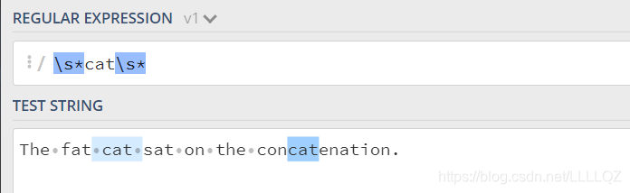

# 介绍

学习来源：[https://blog.csdn.net/LLLLQZ/article/details/118278287](https://blog.csdn.net/LLLLQZ/article/details/118278287)

正则表达式是一组由字母和符号组成的特殊文本，它可以用来从文本中找出满足你想要的格式的句子。一个正则表达式是一种从左到右匹配主体字符串的模式，常使用缩写的术语“[regex](https://so.csdn.net/so/search?q=regex&spm=1001.2101.3001.7020)”或“regexp”。

# 元字符

正则表达式主要依赖于元字符。元字符不代表他们本身的字面意思，他们都有特殊的含义。一些元字符写在方括号中的时候有一些特殊的意思。以下是一些元字符的介绍：


### 字符集[ ]

一般来说 . 点运算符就表示除换行符以外的任意字符，所以我们如果要只是搜索 . 的话就得用转义字符 \. ,但是神奇的是呢，在[ ]里，不论是直接使用点还是转义字符都可以表示.

### *号

匹配 在之前的字符出现大于等于0次。 例如，表达式 a* 匹配0或更多个以a开头的字符。表达式[a-z]* 匹配一个行中所有以小写字母开头的字符串。


表达式 `\s*cat\s*` 匹配0或更多个空格开头和0或更多个空格结尾的cat字符串



`*字符和.字符搭配可以匹配所有的字符.*`

### (…) 特征标群

特征标群是一组写在 (…) 中的子模式。(…) 中包含的内容将会被看成一个整体，和数学中小括号（ ）的作用相同。例如, 表达式 (ab)* 匹配连续出现 0 或更多个 ab。如果没有使用 (…) ，那么表达式 ab* 将匹配连续出现 0 或更多个 b 。再比如之前说的 {} 是用来表示前面一个字符出现指定次数。但如果在 {} 前加上特征标群 (…) 则表示整个标群内的字符重复 N 次。


### 转码特殊字符

反斜线 \ 在表达式中用于转码紧跟其后的字符。用于指定 `{ } [ ] / \ + * . $ ^ | ? `这些特殊字符。如果想要匹配这些特殊字符则要在其前面加上反斜线 \ 。
例如 . 是用来匹配除换行符外的所有字符的。如果想要匹配句子中的 . 则要写成 `\.` 以下这个例子 `\.?` 是选择性匹配.


### 锚点^号和$号

在正则表达式中，想要匹配指定开头或结尾的字符串就要使用到锚点。^ 指定开头，$ 指定结尾

没有锚点^号的表达式效果如下：


有锚点^号的表达式效果如下：


同理，没有锚点$号的效果如下：


有锚点的效果如下：


# 简写字符集

正则表达式提供一些常用的字符集简写。


# 零宽度断言（前后预查）

先行断言和后发断言都属于非捕获簇（不捕获文本 ，也不针对组合计进行计数）。 先行断言用于判断所匹配的格式是否在另一个确定的格式之前，匹配结果不包含该确定格式（仅作为约束）

说人话就是用来做判断的表达式，其本身只是一个条件。

零宽度断言如下：


### 正先行断言

**?=** 为正先行断言，表示第一部分表达式之后必须跟着断言中定义的表达式。

注意这里是要找出The 和 the 后面紧跟着 (空格)fat的字符串，但是正先行断言只是一个判断条件，他不会作为匹配被检索，所以最后匹配到的只是The

### 负先行断言

负先行断言 **?!** 用于筛选所有匹配结果，筛选条件为**其后不跟随着断言中定义的格式**。


### 正后发断言

正后发断言 记作 **?<=** 用于筛选所有匹配结果，筛选条件为**其前跟随着断言中定义的格式**。


### 负后发断言

负后发断言 记作 **?<!** 用于筛选所有匹配结果，筛选条件为**其前不跟随着断言中定义的格式**。


# 标志

标志也叫模式修正符，因为它可以用来修改表达式的搜索结果。 这些标志可以任意的组合使用，它也是整个正则表达式的一部分。


### 多行修饰符 (Multiline)

多行修饰符 m 常用于执行一个多行匹配。

像之前介绍的 (^,$) 用于检查格式是否是在待检测字符串的开头或结尾。但我们如果想要它在每行的开头和结尾生效，我们需要用到多行修饰符 m。


# 贪婪匹配与惰性匹配

正则表达式默认采用贪婪匹配模式，在该模式下意味着会匹配尽可能长的子串。我们可以使用 ? 将贪婪匹配模式转化为惰性匹配模式。

### 贪婪匹配


### 懒惰匹配


# 实际运用

```
package main

import (
	"fmt"
	"regexp"
)

func main() {
	// Compile the expression once, usually at init time.
	// Use raw strings to avoid having to quote the backslashes.
	var validID = regexp.MustCompile(`^[a-z]+\[[0-9]+\]$`)

	fmt.Println(validID.MatchString("adam[23]"))
	fmt.Println(validID.MatchString("eve[7]"))
	fmt.Println(validID.MatchString("Job[48]"))
	fmt.Println(validID.MatchString("snakey"))
}
```

```
Output:

true
true
false
false
```

[学习更多](https://pkg.go.dev/regexp#example-package)
