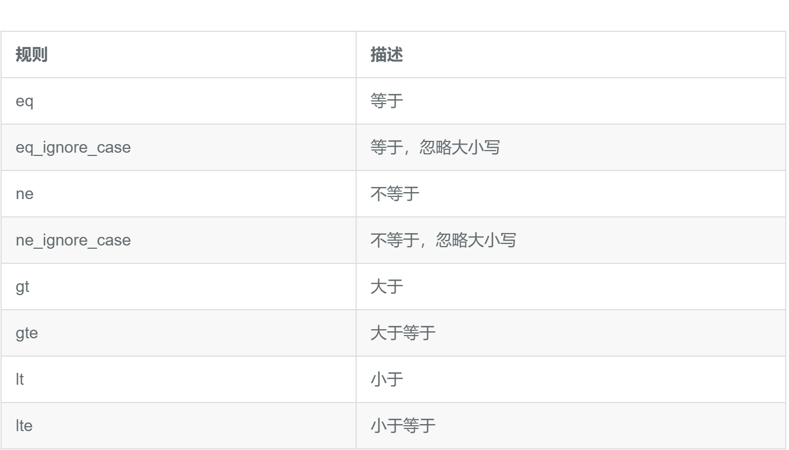
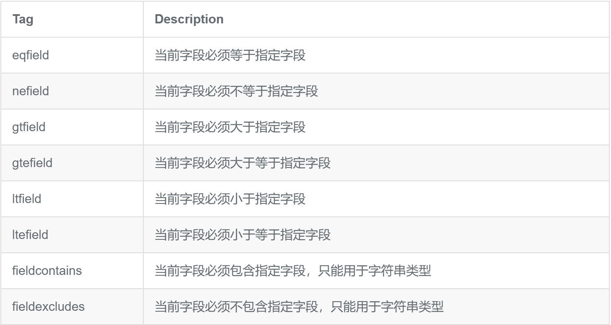
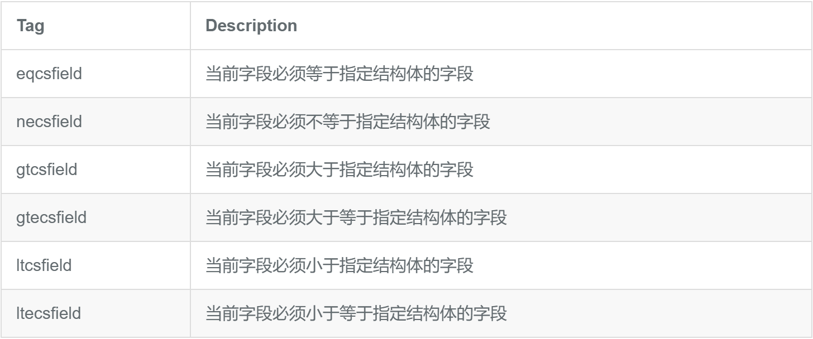
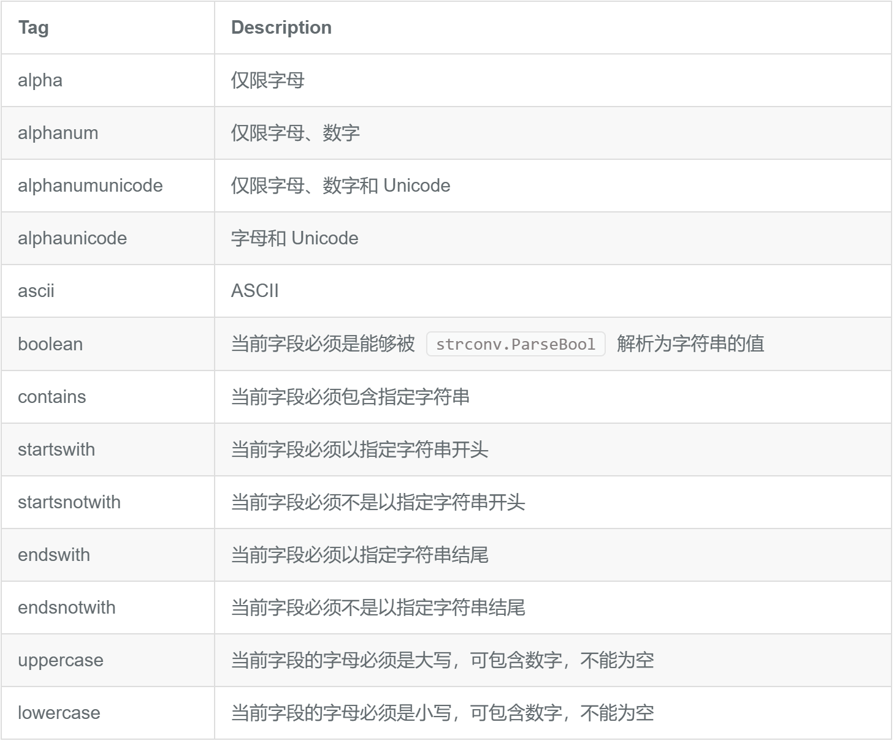
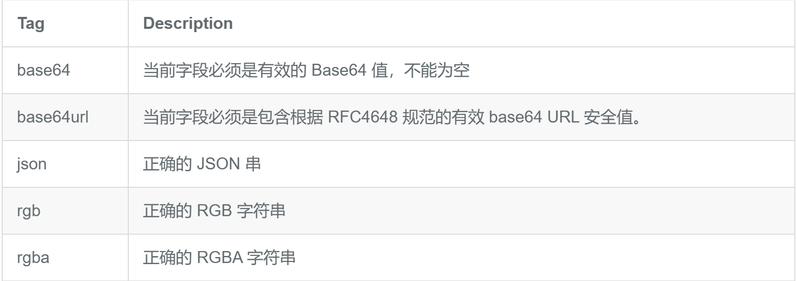
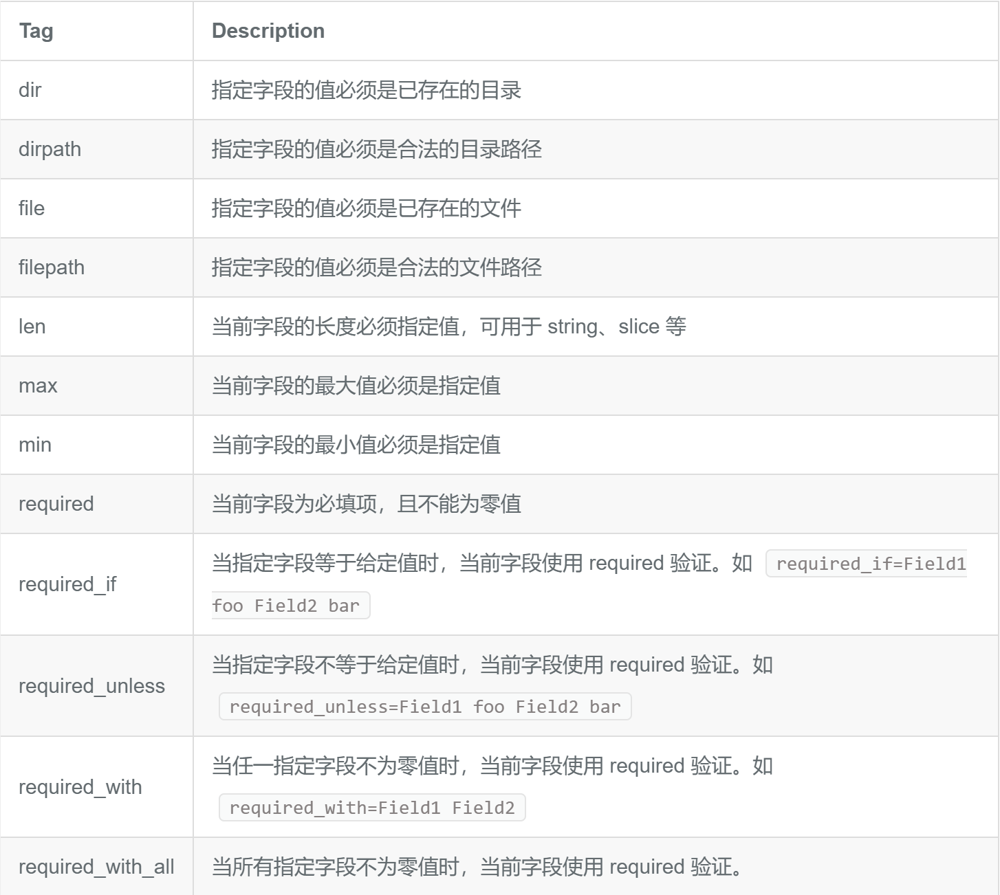

# 简介

`go-playground/validator`实现了一款基于结构体标签的值验证器，它有着以下独一无二的特性：

* 可使用验证标签和自定义验证器来进行跨字段和跨结构体验证
* 切片，数组，map，或者任何多维域都可以被验证
* 可以深入验证map的key和value
* 在验证之前，通过其基本类型来确定如何进行处理
* 可以处理自定义字段类型
* 支持别名标签，它将允许多个验证映射到单个标签上，以便更容易的定义对于结构体的验证
* 可以提取自定义的字段名，例如可以在验证时提取JSON名称以便在错误信息中显示
* 自定义多语言错误信息
* `gin`框架的标准默认验证组件

# 标签

验证器有着非常多的基础验证标签，所有标签对应的验证函数都可以在 `baked_in.go`文件中找到，验证器的结构体 `Tag`是 `valiadte`

```
type User {
	age int `validate:"gte=18"` //表示大于等于18岁
}
```

# 结构体验证

```
func (v *Validate) Struct(s interface{}) error
```

`Struct`方法用于验证一个结构体所有公开的字段，默认会自动进行嵌套结构体验证，当传入非法的值或者传入值为 `nil`时，会返回 `InvalidValidationError`，如果验证失败的错误则返回 `ValidationErrors` 。

```
package validate

import (
	"fmt"
	"github.com/go-playground/validator/v10"
	"testing"
)

type User struct {
	Name    string `validate:"contains=jack"` //名字包含jack
	Age     int    `validate:"gte=18"`        //大于等于18岁
	Address string `valiate:"endwith=市"`      //以市结尾
}

func TestStruct(t *testing.T) {
	validate := validator.New()
	user := User{
		Name:    "jacklove",
		Age:     17,
		Address: "滔博市",
	}
	err := validate.Struct(user)
	for _, err := range err.(validator.ValidationErrors) {
		fmt.Println(err.Namespace()) //命名
		fmt.Println(err.Field())
		fmt.Println(err.StructNamespace())
		fmt.Println(err.StructField())
		fmt.Println(err.Tag())
		fmt.Println(err.ActualTag())
		fmt.Println(err.Kind())
		fmt.Println(err.Type())
		fmt.Println(err.Value())
		fmt.Println(err.Param())
		fmt.Println()
	}
	fmt.Println(err)
}
```

```
输出：
User.Age
Age   
User.Age
Age   
gte   
gte   
int   
int
17
18

Key: 'User.Age' Error:Field validation for 'Age' failed on the 'gte' tag
```

# 字段验证

```
func (v *Validate) Struct(s interface{}) error
```

字段验证的参数不再是基本类型，而是结构体的字段名，可以是自身的字段名，也可以是嵌套结构体的字段名。

```
type Password struct {
   FirstPassword  string `validate:"eqfield=SecondPassword"` //验证两次输入的密码是否相等
   SecondPassword string
}

type RegisterUser struct {
   Username string `validate:"necsfield=Password.FirstPassword"` //禁止密码和用户名一致
   Password Password
}

func TestCrossStructFieldValidate(t *testing.T) {
   validate = validator.New()
   // 失败
   fmt.Println(validate.Struct(RegisterUser{
      Username: "gopher",
      Password: Password{
         FirstPassword:  "gopher",
         SecondPassword: "gophers",
      },
   }))
   // 成功
   fmt.Println(validate.Struct(RegisterUser{
      Username: "gophers",
      Password: Password{
         FirstPassword:  "gopher",
         SecondPassword: "gopher",
      },
   }))
}
```

```
输出：
Key: 'RegisterUser.Username' Error:Field validation for 'Username' failed on the 'necsfield' tag
Key: 'RegisterUser.Password.FirstPassword' Error:Field validation for 'FirstPassword' failed on the 'eqfield' tag
<nil>
```

**使用字段验证时，当Tag作为参数的字段或者结构体不存在时，会直接判断为验证失败**，例如：

```
type Password struct {
   FirstPassword  string `validate:"eqfield=SeconddPaswod"` // SeconddPaswod != SecondPassword
   SecondPassword string
}
```

对于这种拼写错误，很难检查到，而且验证时也仅会以验证未通过的形式展现，需要十分注意。

# 自定义别名

```
func (v *Validate) RegisterAlias(alias, tags string)
```

注册单个验证标记的映射，该标记定义一组常见或复杂的验证，以简化向结构添加验证。

**注意：**此函数不是线程安全的，它的目的是在任何验证之前注册这些函数

在有些时候，对于一个字段有非常多的验证tag，当你想要复用到另一个字段上时，你可能会直接赋值粘贴，不过这并不是最好的解决办法，更好的方法是通过注册别名来提高复用性，请看下面的一个例子:

```
var validate *validator.Validate

const PERSON_NAME_RULES = "max=10,min=1,contains=jack"

func TestAlias(t *testing.T) {
	validate = validator.New()
        // 注册别名
	validate.RegisterAlias("namerules", PERSON_NAME_RULES)
	type person struct {
		FirstName string `validate:"namerules"` // 使用别名
		LastName  string `validate:"namerules"`
	}

	err := validate.Struct(person{
		FirstName: "",
		LastName:  "",
	})

	fmt.Println(err)
}
```

```
输出：
Key: 'person.FirstName' Error:Field validation for 'FirstName' failed on the 'namerules' tag
Key: 'person.LastName' Error:Field validation for 'LastName' failed on the 'namerules' tag
```

# 自定义验证函数

```
func (v *Validate) RegisterValidation(tag string, fn Func, callValidationEvenIfNull ...bool) error
```

使用给定标签添加验证。

**注意：** 如果密钥已经存在，则先前的验证功能将被替换。此方法不是线程安全的，它的目的是在任何验证之前注册这些方法。

虽然组件自带的验证tag足够满足基本时候，可有些时候对于一些特殊需求必须要自己定义逻辑，`Validator`为我们提供了相关的API来自定义验证函数。接下来先看一个例子：

```
func TestCustomValidate(t *testing.T) {
   validate = validator.New()
   fmt.Println(validate.RegisterValidation("is666", is666))
   type Example struct {
      Name string `validate:"is666"`
   }
   fmt.Println(validate.Struct(Example{Name: "777"}))
   fmt.Println(validate.Struct(Example{Name: "666"}))
}

func is666(fl validator.FieldLevel) bool {
   return fl.Field().String() == "666"
}
```

创建了一个函数，判断字段值是不是等于 `"666"`，并且其对应的Tag是 `is666`，输出如下

```
<nil>
Key: 'Example.Name' Error:Field validation for 'Name' failed on the 'is666' tag
```

**提示：**注册的Tag如果已经存在，那么将会被现有的覆盖掉，也就是说可以“重写”默认的Tag校验逻辑。

# 常用验证规则

完整的验证规则表可以参阅[这里](https://pkg.go.dev/github.com/go-playground/validator/v10#readme-baked-in-validations)

详细的验证规则介绍可以参阅[这里](https://pkg.go.dev/github.com/go-playground/validator/v10#pkg-overview)

### 比较



### 跨字段校验



### 跨结构体跨字段校验



### 字符串相关验证



### 格式化验证



### 其他验证



# 翻译器

`validator`库本身是支持国际化的，借助相应的语言包可以实现校验错误提示信息的自动翻译。下面的示例代码演示了如何将错误提示信息翻译成中文，翻译成其他语言的方法类似。

### 基础使用

```
import (
	"github.com/go-playground/locales/zh"
	ut "github.com/go-playground/universal-translator"
	"github.com/go-playground/validator/v10"
	ch_translations "github.com/go-playground/validator/v10/translations/zh"
)

// 全局Validate数据校验实列
var Validate *validator.Validate

// 全局翻译器
var Trans ut.Translator

// 初始化Validator数据校验
func InitValidate() {
	// 创建中文翻译器实例
	chinese := zh.New()

	// 创建一个通用翻译器，并将中文作为默认语言和备用语言
	uni := ut.New(chinese, chinese)

	// 获取中文翻译器
	trans, _ := uni.GetTranslator("zh")

	// 将获取到的翻译器赋值给全局变量 Trans，供后续使用
	Trans = trans

	// 初始化 validator 实例
	Validate = validator.New()
	// 注册翻译器到验证器，这将使验证错误信息以中文格式返回
	_ = ch_translations.RegisterDefaultTranslations(Validate, Trans)
}
```

### （存疑）不知道有什么影响

如果你想在程序的其他地方访问并修改验证引擎的行为，比如添加更多的验证规则，或者对验证行为进行自定义，那么你需要通过 `binding.Validator.Engine()` 来获取底层引擎并进行操作

```
import (
	"fmt"

	"github.com/gin-gonic/gin"
	"github.com/gin-gonic/gin/binding"
	"github.com/go-playground/locales/en"
	"github.com/go-playground/locales/zh"
	ut "github.com/go-playground/universal-translator"
	"github.com/go-playground/validator/v10"
	enTranslations "github.com/go-playground/validator/v10/translations/en"
	zhTranslations "github.com/go-playground/validator/v10/translations/zh"
)

// 定义一个全局翻译器T
var trans ut.Translator

// InitTrans 初始化翻译器
func InitTrans(locale string) (err error) {
	// 修改gin框架中的Validator引擎属性，实现自定制
	if v, ok := binding.Validator.Engine().(*validator.Validate); ok {

		zhT := zh.New() // 中文翻译器
		enT := en.New() // 英文翻译器

		// 第一个参数是备用（fallback）的语言环境
		// 后面的一个或多个参数是应该支持的语言环境
		uni := ut.New(enT, zhT, enT)

		// locale 通常取决于 http 请求头的 'Accept-Language'
		var ok bool
		trans, ok = uni.GetTranslator(locale)
		if !ok {
			return fmt.Errorf("uni.GetTranslator(%s) failed", locale)
		}

		// 注册翻译器
		switch locale {
		case "en":
			err = enTranslations.RegisterDefaultTranslations(v, trans)
		case "zh":
			err = zhTranslations.RegisterDefaultTranslations(v, trans)
		default:
			err = enTranslations.RegisterDefaultTranslations(v, trans)
		}
		return
	}
	return
}
```

```
v, ok := binding.Validator.Engine().(*validator.Validate)
```

# 美化错误提示信息

### 自定义字段名

错误提示中的字段并不是请求中使用的字段，例如：`RePassword`是我们后端定义的结构体中的字段名，而请求中使用的是 `re_password`字段。如何是错误提示中的字段使用自定义的名称，例如 `json tag`指定的值呢？

只需要在初始化翻译器的时候像下面一样添加一个获取 `json tag`的自定义方法即可。

```
// 注册一个获取json tag的自定义方法
v.RegisterTagNameFunc(func(fld reflect.StructField) string {
	name := strings.SplitN(fld.Tag.Get("json"), ",", 2)[0]
	if name == "-" {
		return ""
	}
	return name
})
```

以下是对这段代码的解释：

1. `v.RegisterTagNameFunc(func(fld reflect.StructField) string {...})`：这里是在为某个对象（通常是验证器对象）注册一个用于获取结构体字段标签名的函数。这个函数会在需要确定结构体字段的名称（通常是在进行数据验证或者绑定数据时）被调用。
2. 在注册的函数内部：
   * `name := strings.SplitN(fld.Tag.Get("json"), ",", 2)[0]`：首先通过反射获取结构体字段的 `json`标签值，然后使用 `strings.SplitN`函数以 `,`为分隔符将这个标签值分割成两部分，并取第一部分作为字段的名称。这样做可能是为了处理 `json`标签中可能包含的额外选项（例如 `json:"fieldName,omitempty"`中的 `omitempty`）

     ```
     omitempty作用
     当对一个包含 omitempty 选项的结构体进行 JSON 编码时，如果该字段的值为其类型的零值（例如，对于整数类型是 0，对于字符串类型是 ""，对于指针类型是 nil 等），那么在生成的 JSON 数据中这个字段将被省略，不会出现在最终的 JSON 字符串中
     使用场景
     减少数据传输量：在网络通信中，尤其是在移动设备或带宽有限的环境下，减少不必要的零值字段可以降低数据传输的成本和提高传输效率。
     动态数据结构：当数据结构可能具有不同的状态，某些字段可能在某些情况下为空时，使用 “omitempty” 可以使生成的 JSON 更加简洁，只包含有实际意义的值。
     API 响应：在构建 API 响应时，可以使用 “omitempty” 来确保只返回有实际值的字段，使 API 的输出更加清晰和易于理解。
     ```
   * `if name == "-" { return "" }`：如果获取到的名称是 `-`，则返回一个空字符串。这通常表示该字段在进行数据绑定或验证时应该被忽略。
   * `return name`：如果名称不是 `-`，则返回获取到的字段名称。

### 去掉结构体名称前缀

```
func removeTopStruct(fields map[string]string) map[string]string {
	res := map[string]string{}
	for field, err := range fields {
		res[field[strings.Index(field, ".")+1:]] = err
	}
	return res
}
```
