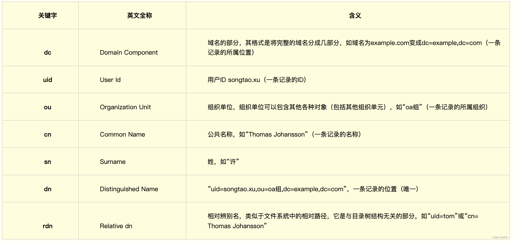

# LDAP简介

目录服务就是按照**树状**存储信息的模式。目录服务的数据类型主要是**字符型** , 而不是关系数据库提供的整数、浮点数、日期、货币等类型。为了检索的需要添加了 `BIN`（二进制数据）、`CIS`（忽略大小写）、`CES`（大小写敏感）、`TEL`（电话型）等语法（`Syntax`）。同样也不提供象关系数据库中普遍包含的大量的[函数](https://marketing.csdn.net/p/3127db09a98e0723b83b2914d9256174?pId=2782&utm_source=glcblog&spm=1001.2101.3001.7020)。

目录有很强的查询（读）功能，适合于进行大量数据的检索。但目录一般只执行简单的更新（写）操作，不支持批量更新所需要的事务处理功能。它主要面向数据的查询服务（查询和修改操作比一般是大于 10:1），不提供事务的回滚（rollback）机制。目录具有广泛复制信息的能力，适合于多个目录服务器同步/更新。

`LDAP（Light Directory Access Portocol）`，是基于X.500标准的轻量级目录访问协议，是一个为查询、浏览和搜索而优化的数据库，它成树状结构组织数据，类似文件目录一样。

LDAP目录服务是由目录数据库和一套访问协议组成的系统。

### 基本模型

每一个系统、协议都会有属于自己的模型，LDAP也不例外，在了解LDAP的基本模型之前我们需要先了解几个LDAP的目录树概念：

**目录树概念**

目录树：在一个目录服务系统中，整个目录信息集可以表示为一个目录信息树，树中的每个节点是一个条目。

条目：每个条目就是一条记录，每个条目有自己的唯一可区别的名称（DN）。

对象类：与某个实体类型对应的一组属性，对象类是可以继承的，这样父类的必须属性也会被继承下来。

属性：描述条目的某个方面的信息，一个属性由一个属性类型和一个或多个属性值组成，属性有必须属性和非必须属性。

**DC、UID、OU、CN、SN、DN、RDN**



# 安装

```
go get github.com/go-ldap/ldap/v3
```

# 连接服务器

```
l, err := ldap.DialURL("ldap://ldap.localhost:389")
if err != nil {
   log.Fatal(err)
}   
defer l.Close()
```

# 绑定服务器

```
err = l.Bind("cn=read-only-admin,dc=example,dc=com", "password")
if err != nil {
   log.Fatal(err)
}
```

# 搜索条目

```
searchRequest := ldap.NewSearchRequest(
   "dc=example,dc=com",
   ldap.ScopeWholeSubtree, ldap.NeverDerefAliases, 0, 0, false,
   fmt.Sprintf("(&(objectClass=organizationalPerson)(uid=%s))", ldap.EscapeFilter(username)),
   []string{"dn"},
   nil,
)
sr, err := l.Search(searchRequest)
if err != nil {
   log.Fatal(err)
}
if len(sr.Entries) != 1 {
   log.Fatal("User does not exist or too many entries returned")
}
userdn := sr.Entries[0].DN
fmt.Println(userdn)
```

### NewSearchRequest

```
func NewSearchRequest(
	BaseDN string,
	Scope, DerefAliases, SizeLimit, TimeLimit int,
	TypesOnly bool,
	Filter string,
	Attributes []string,
	Controls []Control,
) *SearchRequest
```

##### 参数说明

BaseDN：基本目录名称，定义搜索操作从哪个节点开始。

` 例："dc=example,dc=com"`

Scope：搜索范围，决定搜索应该如何遍历目录树。

常用值:

```
ldap.ScopeBaseObject: 仅搜索指定的 BaseDN 节点。
ldap.ScopeSingleLevel: 搜索 BaseDN 的直接子节点。
ldap.ScopeWholeSubtree: 搜索整个子树，包括 BaseDN。
```

DerefAliases：指定如何处理别名。

* 常用值:
  * `ldap.NeverDerefAliases`: 从不解引用别名。
  * `ldap.DerefInSearching`: 在搜索过程中解引用别名。
  * `ldap.DerefFindingBaseObj`: 在寻找 `BaseDN` 时解引用别名。
  * `ldap.DerefAlways`: 总是解引用别名。

SizeLimit：设置返回条目的最大数量限制。`0` 表示无限制（受服务器默认配置限制）。

TimeLimit：搜索操作的时间限制（秒）。`0` 表示无时间限制。

TypesOnly：指定是否仅返回属性的类型而不返回属性的值。

```
true: 仅返回属性类型。
false: 返回属性值。
```

Filter：LDAP 搜索的过滤条件，使用标准的 LDAP 查询语法。

示例:

```
"(objectClass=person)": 搜索所有 objectClass 为 person 的条目。
"(&(objectClass=person)(cn=John Doe))": 搜索 objectClass 为 person 且 cn 为 John Doe 的条目。
```

Attributes：指定需要返回的属性名称列表。

如果为空（`nil` 或空切片），则返回所有属性。

示例:

```
Attributes: []string{"cn", "mail", "uid"}
```

Controls：可选的 LDAP 控制列表，用于指定额外的操作行为。

示例:

```
分页控制，密码策略控制...
```

### EscapeFilter

该函数用于转义（escape）传入的 LDAP 过滤器字符串。

它主要针对以下特殊字符进行转义：

```
( 左括号 
) 右括号
* 星号
\ 反斜杠 
```

这些字符在 LDAP 过滤器中具有特定语法意义，因此需要转义以避免解析错误或潜在的安全问题。

除了上述特殊字符，ASCII 范围外的字符也会被转义：

```
小于 0x00（不可显示字符）
大于等于 0x80（非 ASCII 字符）
```

这是为了确保符合 LDAP 过滤器的编码规范。

该行为基于 RFC 4515 中的标准实现，该标准定义了 LDAP 搜索过滤器语法及其转义规则。

# 添加条目

```
addRequest := ldap.NewAddRequest("cn=newUser,ou=People,dc=example,dc=com", nil)
addRequest.Attribute("objectClass", []string{"inetOrgPerson"})
addRequest.Attribute("cn", []string{"newUser"})
addRequest.Attribute("sn", []string{"NewUser"})
addRequest.Attribute("uid", []string{"newUser"})
err := l.Add(addRequest)
if err != nil {
   log.Fatal(err)
}
```

# 删除条目

```
delRequest := ldap.NewDelRequest("cn=newUser,ou=People,dc=example,dc=com", nil)
err := l.Del(delRequest)
if err != nil {
   log.Fatal(err)
}
```

# 修改条目

```
modifyRequest := ldap.NewModifyRequest("cn=newUser,ou=People,dc=example,dc=com")
modifyRequest.Replace("mail", []string{"newUser@example.com"})
err := l.Modify(modifyRequest)
if err != nil {
   log.Fatal(err)
}
```

# 断开连接

```
err = l.Unbind()
if err != nil {
   log.Fatal(err)
}
```

# 实践经验

### 连接池

```
package common

import (
	"fmt"
	"log"
	"math/rand"
	"net"
	"sync"
	"time"

	"github.com/eryajf/go-ldap-admin/config"

	ldap "github.com/go-ldap/ldap/v3"
)

var ldapPool *LdapConnPool
var ldapInit = false
var ldapInitOne sync.Once

// GetLDAPConn 获取 LDAP 连接
func GetLDAPConn() (*ldap.Conn, error) {
	return ldapPool.GetConnection()
}

// PutLDAPConn 放回 LDAP 连接
func PutLADPConn(conn *ldap.Conn) {
	ldapPool.PutConnection(conn)
}

type LdapConnPool struct {
	mu       sync.Mutex
	conns    []*ldap.Conn
	reqConns map[uint64]chan *ldap.Conn
	openConn int
	maxOpen  int
}

// 获取一个 ladp Conn
func (lcp *LdapConnPool) GetConnection() (*ldap.Conn, error) {
	lcp.mu.Lock()
	// 判断当前连接池内是否存在连接
	connNum := len(lcp.conns)
	if connNum > 0 {
		lcp.openConn++
		conn := lcp.conns[0]
		copy(lcp.conns, lcp.conns[1:])
		lcp.conns = lcp.conns[:connNum-1]

		lcp.mu.Unlock()
		// 发现连接已经 close 重新获取连接
		if conn.IsClosing() {
			return initLDAPConn()
		}
		return conn, nil
	}

	// 当现有连接池为空时，并且当前超过最大连接限制
	if lcp.maxOpen != 0 && lcp.openConn > lcp.maxOpen {
		// 创建一个等待队列
		req := make(chan *ldap.Conn, 1)
		reqKey := lcp.nextRequestKeyLocked()
		lcp.reqConns[reqKey] = req
		lcp.mu.Unlock()

		// 等待请求归还
		return <-req, nil
	} else {
		lcp.openConn++
		lcp.mu.Unlock()
		return initLDAPConn()
	}
}

func (lcp *LdapConnPool) PutConnection(conn *ldap.Conn) {
	log.Println("放回了一个 LDAP 连接")
	lcp.mu.Lock()
	defer lcp.mu.Unlock()

	// 先判断是否存在等待的队列
	if num := len(lcp.reqConns); num > 0 {
		var req chan *ldap.Conn
		var reqKey uint64
		for reqKey, req = range lcp.reqConns {
			break
		}
		delete(lcp.reqConns, reqKey)
		req <- conn
		return
	} else {
		lcp.openConn--
		if !conn.IsClosing() {
			lcp.conns = append(lcp.conns, conn)
		}
	}
}

// 获取下一个请求令牌
func (lcp *LdapConnPool) nextRequestKeyLocked() uint64 {
	for {
		reqKey := rand.Uint64()
		if _, ok := lcp.reqConns[reqKey]; !ok {
			return reqKey
		}
	}
}

// 获取 ladp 连接
func initLDAPConn() (*ldap.Conn, error) {
	ldap, err := ldap.DialURL(config.Conf.Ldap.Url, ldap.DialWithDialer(&net.Dialer{Timeout: 5 * time.Second}))
	if err != nil {
		return nil, err
	}
	err = ldap.Bind(config.Conf.Ldap.AdminDN, config.Conf.Ldap.AdminPass)
	if err != nil {
		return nil, err
	}
	return ldap, err
}
```

```
分析：
所有的Conn都由initLDAPConn（）产生，本质是一样的。
Conn有两种：空闲在连接池LdapConnPool.conns和处于工作状态中，LdapConnPool.openConn是工作状态下连接的数量。
实际上等待通道只会有一个Conn需求等待，因为建立等待通道，通道是空的，无法从通道获取Conn，所以会堵塞，直达刚从工作状态脱离的Conn被发送到通道中，Conn随即被取出再次进入工作状态，通道从LdapConnPool.reqConns销毁。
```
