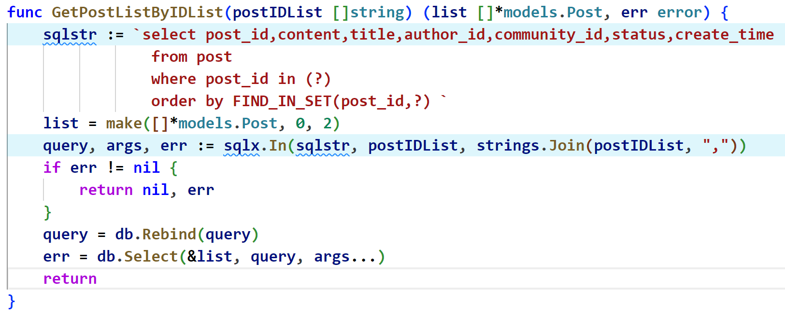

# 报错解决方案

### sqlx 查询数据库时报错：

##### `scannable dest type slice with >1 columns (2) in result`

查询多条数据时采用了 Get 函数，应当使用 Select 函数

##### `sql: converting argument $1 type: unsupported type []interface {}, a slice of interface`

```
报错：err = db.select(&list,query,args)
正确：err = db.select(&list,query,args...)
原因：https://www.codeleading.com/article/41255309805/
```


