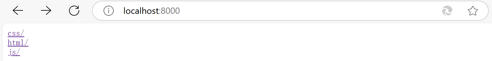
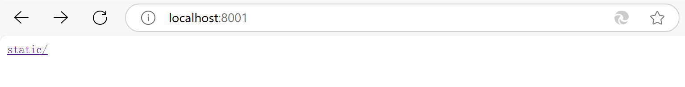
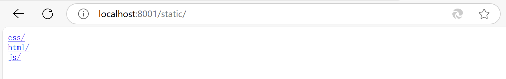
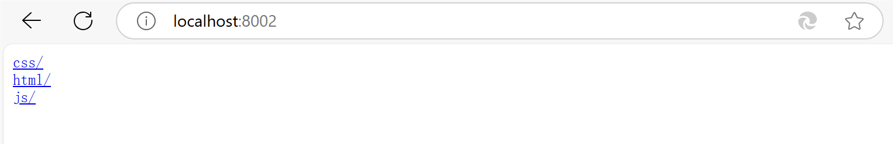
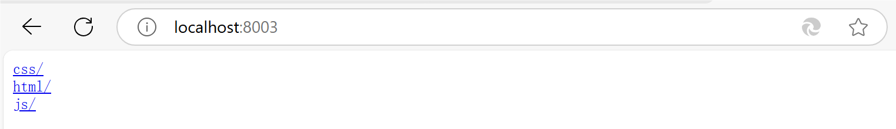

# 介绍

`//go:embed` 在 Go 1.16 版本中被加入。[学习更多](https://segmentfault.com/a/1190000045063547#item-6)。

`//go:embed` 是一个 **编译器指令** ，能够在程序编译时期在 Go 的二进制文件中嵌入 **任意文件和目录** （除了少数 Go 官方限制不允许嵌入的指定类型文件或目录，后文会讲）。

# 嵌入文件内容

```
import "embed"

//将文件嵌入到 `string` 中，适合嵌入单个文件（如配置数据、模板文件或一段文本）
//go:embed hello.txt
var content string

//将文件嵌入到 `[]byte` 中，适合嵌入单个文件（如二进制文件：图片、字体或其他非文本数据）
//go:embed hello.txt
var contentBytes []byte

//将文件嵌入到 `embed.FS` 中，适合嵌入多个文件或整个目录（`embed.FS` 是一个只读的虚拟文件系统）
//go:embed hello.txt
var fileFS embed.FS
var data, _ = fileFS.ReadFile("hello.txt")
```

我们**有且仅有 3 种方式**可以将一个文件内容嵌入到 Go 变量中。

`//go:embed` 指令语法格式为：`//go:embed patterns`，其中 `patterns` 可以是文件名、目录名或 `path.Match` 所支持的路径通配符。

值得注意的是：`//go:embed` 指令仅接受相对于包含 Go 源文件的目录的路径，即当前程序源码所在目录，不能直接嵌入父目录文件内容（后文会讲解解决方案）。

并且，`//go:embed` 指令要紧挨着写在被嵌入文件的变量上面，类似注释，`//go:embed` 是固定写法，字符中间不能含有任何空格。比如 `// go:embed` 这种写法是不能被解析的。

此外，`//go:embed` 指令需要配合 `embed` 包一起使用。

# 快速开始

下面我们来通过一个示例程序，演示下 `//go:embed` 的使用。

准备如下项目目录结构：

```
$ tree -a getting-started
getting-started
├── file
│   ├── hello1.txt
│   ├── hello2.txt
│   └── sub
│       └── sub.txt
├── go.mod
├── hello.txt
└── main.go

3 directories, 6 files
```

在 `main.go` 中编写示例代码如下：

```
package main

import (
    "embed"
    "fmt"
    "io"
    "io/fs"
)

//与源文件同级目录

//go:embed hello.txt
var content string


//与源文件不同级目录

//go:embed file
var fileFS embed.FS

//go:embed file/hello1.txt
//go:embed file/hello2.txt
var helloFS embed.FS

func main() {
    fmt.Printf("hello.txt content: %s\n", content)

    // embed.FS 提供了 ReadFile 功能，可以直接读取文件内容，文件路径需要指明父目录 `file`
    hello1Bytes, _ := fileFS.ReadFile("file/hello1.txt")
    fmt.Printf("file/hello1.txt content: %s\n", hello1Bytes)

    // embed.FS 提供了 ReadDir 功能，通过它可以遍历一个目录下的所有信息
    dir, _ := fs.ReadDir(fileFS, "file")
    for _, entry := range dir {
        info, _ := entry.Info()
        fmt.Printf("%+v\n", struct {
            Name  string
            IsDir bool
            Info  struct {
                Name string
                Size int64
                Mode fs.FileMode
            }
        }{
            Name:  entry.Name(),
            IsDir: entry.IsDir(),
            Info: struct {
                Name string
                Size int64
                Mode fs.FileMode
            }{Name: info.Name(), Size: info.Size(), Mode: info.Mode()},
        })
    }

    // embed.FS 实现了 io/fs.FS 接口，可以返回它的子文件夹作为新的 io/fs.FS 文件系统
    subFS, _ := fs.Sub(helloFS, "file")
    hello2F, _ := subFS.Open("hello2.txt")
    hello2Bytes, _ := io.ReadAll(hello2F)
    fmt.Printf("file/hello2.txt content: %s\n", hello2Bytes)
}
```

示例程序中，将 `hello.txt` 分别嵌入到 `content string`、`contentBytes []byte` 两个变量。

我们可以通过 `//go:embed 目录名` 的方式，将 `file` 目录嵌入到 `fileFS embed.FS` 文件系统。

对于 `embed.FS` 文件系统，我们可以连续写上多个 `//go:embed` 指令，来嵌入多个文件到 `helloFS embed.FS`。

并且，对于 `helloFS embed.FS` 这段代码：

```
//go:embed file/hello1.txt
//go:embed file/hello2.txt
var helloFS embed.FS
```

还有另一种写法：

```
//go:embed file/hello1.txt file/hello2.txt
var helloFS embed.FS
```

二者等价。

在 `main` 函数中，首先对 `content string` 和 `contentBytes []byte` 的字符串格式内容进行了打印。

接着，使用 `embed.FS` 提供的 `ReadFile` 方法读取 `file/hello1.txt` 文件内容（注意：**文件路径必须要指明父目录 `file`，否则会找不到 `hello1.txt` 文件**）并打印。

此外，`embed.FS` 还提供了 `fs.ReadDir` **方法可以读取指定目录下所有文件信息**。

最后，由于 `embed.FS` 实现了 `io/fs.FS` 接口，我们可以使用 `fs.Sub` 获取指定目录的子文件系统，然后就可以用 `subFS.Open("hello2.txt")` **方式直接读取** `hello2.txt` **内容（无需再指明父目录）并打印了**。

# patterns 规则

`//go:embed patterns` 指令的 `patterns` 参数，不支持嵌入空目录，并且也不支持嵌入符号链接（`symbolic links`），即软链接。也不能匹配一些特殊符号：`" * < > ? ` ' |  /  \` 。

根据前文的示例程序，`patterns` 指定为目录时，该目录下的所有文件都会被嵌入到变量中。但是以 `.` 或 `_` 开头的文件是会被忽略的。如果想要嵌入 `.` 或 `_` 开头的文件，参照以下示例：

```
image 不会嵌入 image/.tempfile 文件。
image/* 会嵌入 image/.tempfile 文件。
以上二者都不会嵌入 image/dir/.tempfile。
all:image 则会同时嵌入 image/.tempfile 和 image/dir/.tempfile 两个文件。
```

注意，使用 `//go:embed` 嵌入带有路径的文件时，目录分隔符采用正斜杠 `/`，如 `//go:embed file/hello1.txt`，即使是 Windows 系统也是如此。

`patterns` 支持使用双引号 " 或者反引号 ` 的方式应用到嵌入的文件名、目录名或者 pattern 上，这对名称中带有空格或特殊字符很有用。

此外，诸如 `.bzr`、`.hg`、`.git`、`.svn` 这几个版本控制管理目录，始终都不会被嵌入，`embed` 相关代码中会做检查。

不要在 `patterns` 路径中包含特殊字符，比如 `-`、`$` 等。不然，根据我的实测结果，你将得到类似 `imports embed/testdata: invalid input file name "$not-hidden/fortune.txt"` 报错信息。

# 集成 http 服务

```
http
├── go.mod
├── main.go
└── static
    ├── css
    │   └── style.css
    ├── hello.txt
    ├── html
    │   └── index.html
    ├── img
    │   └── subscribe.jpeg
    └── js
        └── script.js

```

### 未使用 embed

```
http.Handle("/", http.FileServer(http.Dir("static")))
http.ListenAndServe(":8000", nil)
```



### 使用 embed

##### 含有目录前缀

```
http.ListenAndServe(":8001", http.FileServer(http.FS(staticFS)))
```





##### 去除目录前缀

**http.StripPrefix**

```
http.Handle("/static/", http.StripPrefix("/static/", http.FileServer(http.FS(staticFS))))
http.ListenAndServe(":8002", nil)
```



**fs.Sub**

```
fsSub, _ := fs.Sub(staticFS, "static")
http.ListenAndServe(":8003", http.FileServer(http.FS(fsSub)))
```



# 集成 gin 框架

我们使用中间件的形式来实现集成，[为什么](https://www.itfanr.cc/2022/08/18/golang-embed-static-files/)。

```
package middleware

import ...

const INDEX = "index.html"

type ServeFileSystem interface {
	http.FileSystem
	Exists(prefix string, path string) bool
}

type localFileSystem struct {
	http.FileSystem
	root    string
	indexes bool
}

func LocalFile(root string, indexes bool) *localFileSystem {
	return &localFileSystem{
		FileSystem: gin.Dir(root, indexes),
		root:       root,
		indexes:    indexes,
	}
}

func (l *localFileSystem) Exists(prefix string, filepath string) bool {
	if p := strings.TrimPrefix(filepath, prefix); len(p) < len(filepath) {
		name := path.Join(l.root, p)
		stats, err := os.Stat(name)
		if err != nil {
			return false
		}
		if stats.IsDir() {
			if !l.indexes {
				index := path.Join(name, INDEX)
				_, err := os.Stat(index)
				if err != nil {
					return false
				}
			}
		}
		return true
	}
	return false
}

func ServeRoot(urlPrefix, root string) gin.HandlerFunc {
	return Serve(urlPrefix, LocalFile(root, false))
}

// Static returns a middleware handler that serves static files in the given directory.
func Serve(urlPrefix string, fs ServeFileSystem) gin.HandlerFunc {
	fileserver := http.FileServer(fs)
	if urlPrefix != "" {
		fileserver = http.StripPrefix(urlPrefix, fileserver)
	}
	return func(c *gin.Context) {
		if fs.Exists(urlPrefix, c.Request.URL.Path) {
			fileserver.ServeHTTP(c.Writer, c.Request)
			c.Abort()
		}
	}
}

type embedFileSystem struct {
	http.FileSystem
}

func (e embedFileSystem) Exists(prefix string, path string) bool {
	_, err := e.Open(path)
	return err == nil
}

func EmbedFolder(fsEmbed embed.FS, targetPath string) ServeFileSystem {
	fsys, err := fs.Sub(fsEmbed, targetPath)
	if err != nil {
		panic(err)
	}
	return embedFileSystem{
		FileSystem: http.FS(fsys),
	}
}
```

关于中间件的底层逻辑，待进一步学习......

```
package main

import ...

//go:embed static
var staticFS embed.FS

func main() {
	r := gin.Default()
	r.Use(middleware.Serve("/", middleware.EmbedFolder(staticFS, "static")))
	r.NoRoute(func(c *gin.Context) {
		data, err := staticFS.ReadFile("static/index.html")
		if err != nil {
			_ = c.AbortWithError(http.StatusInternalServerError, err)
			return
		}
		c.Data(http.StatusOK, "text/html; charset=utf-8", data)
	})
	r.Run(":8080")
}
```

使用守则（一般情况下改这几个）：

```
//go:embed yourStaticFliePlace
var staticFS embed.FS
```

定义 go:embed 的 go 文件要与 static 文件处于同一级目录。

```
middleware.EmbedFolder(staticFS, "yourStaticFliePlace")
```

第二个参数与嵌入的文件名一致，用于 `fs.Sub()` 读取该目录下子文件。

```
staticFS.ReadFile("yourStaticFliePlace/index.html")
```

参数为 index.html 的相对目录，和示例保持一致时，根目录为 `"/"`
