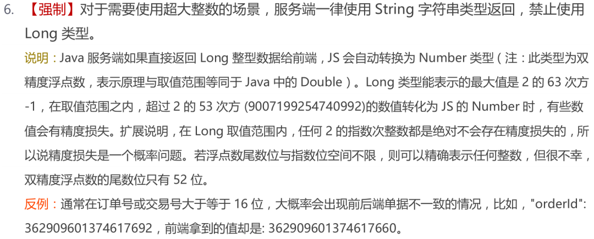
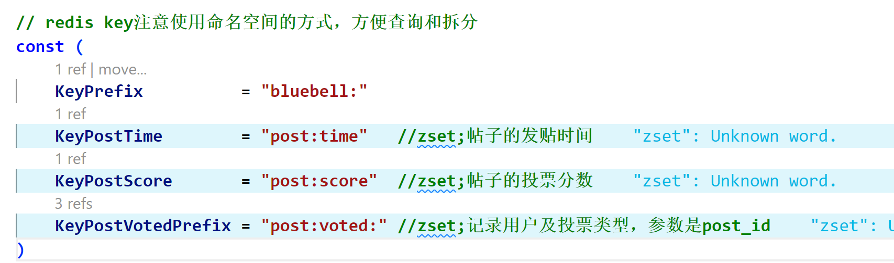
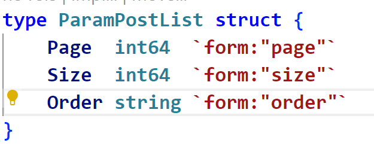

# 项目实践经验

#### 设计用户表

不使用数据库自增id作为用户id

* 用户注册时会暴露app用户总量
* 分库分表时用户id可能会重复

#### 设计日志

在不同的模式考虑不同的输出位置，如：开发模式时终端输出日志，发行模式则没有必要

#### 查询数据库无结果

```
err == sql.ErrNoRows
```

#### 不要循环引用代码

`报错信息：import cycle not allowed`

当一个包 A 导入了包 B，而包 B 又反过来导入了包 A，就会产生循环导入错误

#### Go内存对齐

[关于内存对齐](https://geektutu.com/post/hpg-struct-alignment.html)：一个结构体实例所占据的空间等于各字段占据空间之和，再加上内存对齐的空间大小，合理的内存对齐可以提高内存读写的性能，并且便于实现变量操作的原子性

#### 传给前端数字id失真



[go语言json技巧](https://www.liwenzhou.com/posts/Go/json-tricks/)

#### 固定不变的定义为常量



#### 减少硬编码

当代码中出现需要一些固定字符串的时候将他们定义为常量，不要直接在代码中出现

#### 获取 query string 参数时使用 form 绑定

`http://localhost:8080/api/v1/posts2?page=1&order=time`


